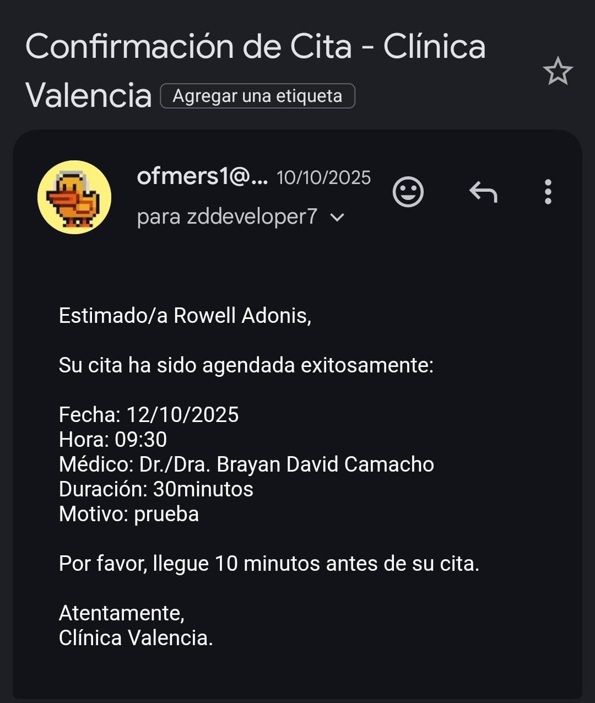

# Clínica Dermatológica Valencia – Sistema de Gestión

Sistema web académico para la gestión integral de una clínica dermatológica, desarrollado con **Django** y **Django REST Framework**.  
Incluye autenticación de usuarios, control de pacientes, registro de consultas, notificaciones y un panel administrativo.

---

## 🚀 ¿Qué hace este proyecto?

- Autenticación de usuarios (login / registro)
- Roles de usuario (admin / operador)
- Gestión de pacientes
- Registro de consultas médicas
- Panel administrativo (dashboard)
- Sistema de notificaciones
- Bitácora de acciones
- API REST para consumo externo
- Base de datos relacional
- Interfaz web responsiva

---

## 🧠 Características Técnicas

- Backend con Django
- API REST con Django REST Framework
- Sistema de autenticación y roles
- CRUD de pacientes
- CRUD de consultas
- Gestión de usuarios
- Sistema de notificaciones internas
- Panel administrativo
- Bitácora de eventos del sistema
- Arquitectura MVC
- Separación frontend / backend

---

## 🛠️ Tecnologías Utilizadas

| Tecnología | Uso |
|-----------|-----|
| Python 3.10+ | Lenguaje principal |
| Django | Backend |
| Django REST Framework | API REST |
| HTML / CSS / JS | Interfaz web |
| Bootstrap | Estilos UI |
| MySQL / SQLite | Base de datos |
| GitHub Actions | CI básico |
| JWT (opcional) | Autenticación API |

---

## 📷 Capturas de Pantalla

### Login

### Roles

### Historial

### Notificaciones

