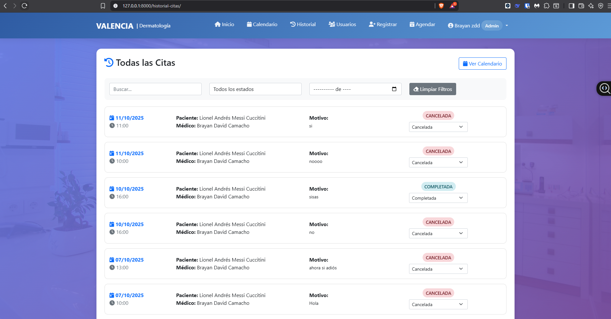
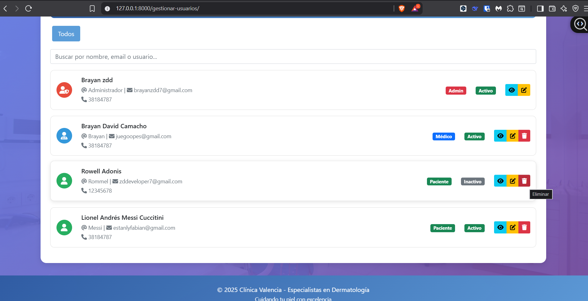

# Clínica Dermatológica Valencia - Sistema de Gestión

Sistema web académico para la gestión de una clínica dermatológica, desarrollado con Django y Django REST Framework.

## Funcionalidades
- Gestión de usuarios
- Control de pacientes
- Registro de consultas
- Administración básica del sistema

## Tecnologías utilizadas
- Python
- Django
- Django REST Framework
- Base de datos relacional

## Estado del proyecto
Proyecto académico. El sistema fue funcional durante su desarrollo; actualmente se presenta el código como evidencia de la estructura y lógica del sistema.

## 📷 Capturas de Pantalla

### 🔐 Login

### 🏠 Historial

### 📅 Notificaciones

### 🧑‍🤝‍🧑 Usuarios

